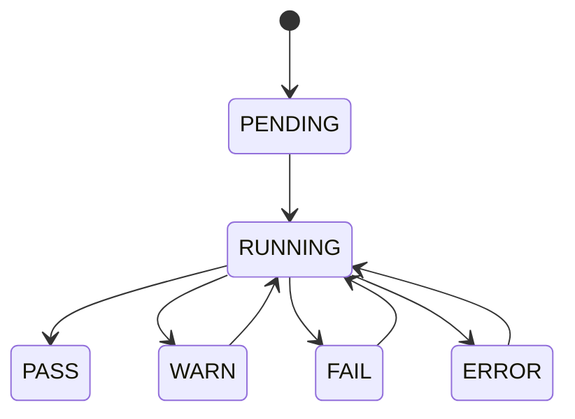

# TaskSpec

## Purpose

Define the durable specification for the Task Spec domain object in MediaPrep Studio.

## Scope

This specification covers data shape, validation, lifecycle, persistence mapping, serialization, and API usage for Task Spec records.

## Data Model

The Task Spec model is a structured object owned by the core domain layer. Application services may enrich it with metadata, validation results, and operational state, but callers should not mutate persisted records without going through a service boundary.

## Fields

| Field | Type | Required | Description |
| --- | --- | --- | --- |
| id | string | yes | Stable identifier for the Task Spec record. |
| project_id | string | context | Owning project when the record belongs to a project. |
| name | string | yes | Human-readable label. |
| status | string | yes | PASS, WARN, FAIL, PENDING, RUNNING, or ERROR where applicable. |
| created_at | datetime | yes | First creation timestamp in ISO 8601 format. |
| updated_at | datetime | yes | Last update timestamp in ISO 8601 format. |
| metadata | object | no | Extensible metadata for subsystem-specific values. |

## JSON Example

```json
{
  "id": "task_spec-001",
  "project_id": "project-001",
  "name": "Example Task Spec",
  "status": "PASS",
  "created_at": "2026-06-27T12:00:00Z",
  "updated_at": "2026-06-27T12:00:00Z",
  "metadata": {
    "source": "media-prep-studio"
  }
}
```

## SQLite Mapping

| SQLite Column | Type | Notes |
| --- | --- | --- |
| id | TEXT PRIMARY KEY | Stable object id. |
| project_id | TEXT | Indexed when project scoped. |
| name | TEXT | Display name. |
| status | TEXT | Domain status enum. |
| created_at | TEXT | ISO 8601 datetime. |
| updated_at | TEXT | ISO 8601 datetime. |
| metadata_json | TEXT | JSON-encoded extension payload. |

## Python Dataclass Draft

```python
from dataclasses import dataclass, field
from datetime import datetime
from typing import Any

@dataclass(slots=True)
class TaskSpec:
    id: str
    name: str
    status: str
    created_at: datetime
    updated_at: datetime
    project_id: str | None = None
    metadata: dict[str, Any] = field(default_factory=dict)
```

## Lifecycle

1. Created by an import, scan, validation, processing, or configuration workflow.
2. Enriched by metadata and validation services.
3. Persisted in SQLite or future project databases.
4. Read by UI, CLI, API, reporting, or automation layers.
5. Archived, exported, or migrated when projects are packaged.

## State Machine



## Validation Rules

- Required identifiers must be non-empty strings.
- Status must be one of the documented enum values.
- Datetimes must serialize as ISO 8601 strings.
- Metadata must remain JSON serializable.
- Cross-object references must point to existing project, asset, job, task, preset, or plugin records when applicable.

## Error Handling

Invalid records should be rejected at service boundaries with structured errors. Batch operations must continue processing independent records and collect failures in the validation report.

## API Mapping

- CLI: exposed through scan, validation, manifest, verify, dashboard, and future project commands.
- Python API: returned as dataclasses or typed dictionaries.
- REST API: serialized as JSON objects under future `/api/*` endpoints.
- Plugin API: exposed only through stable SDK contracts.

## Thread Safety

Domain objects should be treated as immutable snapshots across worker threads. Long-running operations should publish progress through queues or task records instead of mutating shared state directly.

## Serialization

JSON is the default interchange format. SQLite stores structured extension fields as JSON text until a table requires normalized query performance.

## Examples

- Use this spec when adding database migrations.
- Use this spec when exposing new API endpoints.
- Use this spec when writing plugin SDK examples.

## Related Documents

- `docs/01_Architecture/SystemOverview.md`
- `docs/08_Database/Schema.md`
- `docs/10_API/ApplicationAPI.md`
- `docs/11_Testing/RegressionTesting.md`

## Revision History

- Documentation version: 1.0
- Last updated: 2026-06-27
